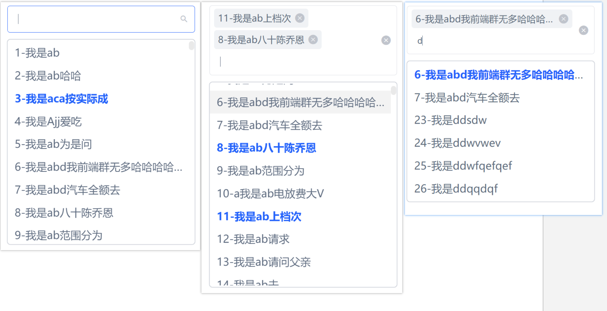

# v3-HUI

## 1.	h-selector

#### 属性说明 属性类型

| <span style="display:inline-block;width:60px">属性</span> | <span style="display:inline-block;width:350px">说明</span>   | <span style="display:inline-block;width:100px">类型</span> | <span style="display:inline-block;width:100px">默认</span> |
| :-------------------------------------------------------- | :----------------------------------------------------------- | :--------------------------------------------------------- | :--------------------------------------------------------- |
| v-model                                                   | 绑定值                                                       | 单选为 string/number<br />多选[multiple = true]为 array    | -                                                          |
| multiple                                                  | 是否多选                                                     | Boolean                                                    | false                                                      |
| placeholder                                               | 占位符                                                       | string                                                     | 请选择                                                     |
| `autoShowMenu`                                            | 是否聚焦时自动展开下拉菜单                                   | Boolean                                                    | true                                                       |
| data                                                      | 列表数据                                                     | array                                                      | []                                                         |
| `defaultPorp`                                             | 选项绑定属性                                                 | object                                                     | { value: 'value', label: 'label' }                         |
| loading                                                   | 加载状态,远程加载时可用                                      | Boolean                                                    | false                                                      |
| remote                                                    | 是否自定义过滤筛选 与 `remoteMethod `配合使用                | Boolean                                                    | false                                                      |
| `remoteMethod`                                            | 自定义过滤筛选方法, query为input输入值(已做防抖处理)         | function                                                   | (query) => {}                                              |
| `scrollBottomValue`                                       | 下拉菜单滚动距离底部间距触发 `selectMenuScroll` 方法         | number                                                     | 50                                                         |
| `selectMenuScroll`                                        | 下拉菜单滚动加载方法                                         | function                                                   | -                                                          |
| `customInput`                                             | 是否自定义input输入,配合方法 `changeInputValue`使用, 若选择自定义则自定义过滤筛选`remoteMethod`无效 | Boolean                                                    | false                                                      |

#### slot

| <span style="display:inline-block;width:60px">属性</span> | <span style="display:inline-block;width:300px">说明</span>   | <span style="display:inline-block;width:100px">类型</span> | <span style="display:inline-block;width:100px"> 默认</span> |
| :-------------------------------------------------------- | :----------------------------------------------------------- | :--------------------------------------------------------- | :---------------------------------------------------------- |
| empty                                                     | data值为空时显示文本, 如果使用,则data为空时与筛选无数据时为同一个 |                                                            | 无数据                                                      |
| loading                                                   | 加载中,异步数据加载时显示文本                                |                                                            | 加载中                                                      |
| option                                                    | 菜单选项                                                     |                                                            | -                                                           |
|                                                           |                                                              |                                                            |                                                             |

#### 

#### 方法说明 @类型

| <span style="display:inline-block;width:60px">属性</span> | <span style="display:inline-block;width:300px">说明</span>   | <span style="display:inline-block;width:100px">类型</span> | <span style="display:inline-block;width:100px"> 默认</span> |
| :-------------------------------------------------------- | :----------------------------------------------------------- | :--------------------------------------------------------- | :---------------------------------------------------------- |
| `changeInputValue`                                        | 自定义input输入事件,注意使用时会终止内部筛选和自定义筛选方法 | fun                                                        | (query) => {}                                               |
| `selected`                                                | 菜单选项被点击时触发,返回被点击的项和选中的项                | fun                                                        | (option, checked) => {}                                     |
| clear                                                     | 清空                                                         | fun                                                        | -                                                           |
| `onBlur`                                                  | input失焦                                                    | fun                                                        | -                                                           |
| `onFocus`                                                 | input聚焦                                                    | fun                                                        | -                                                           |
| `closeTag`                                                | 多选关闭选项,返回被关闭的项                                  | fun                                                        | (tag) => {}                                                 |
|                                                           |                                                              |                                                            |                                                             |

#### 效果




```vue
<template>
  <div>
      单选
      <h-selector
        class="my-select"
        v-model="value"
        placeholder="请输入关键字搜索"
        :data="options"
        :defaultPorp="{value: 'id', label: 'text'}"
        remote
        :loading="loading"
        :remote-method="filterable"
      >
        <template #empty>
          <span>没有无数据呢</span>
        </template>
      </h-selector>
		<!-- 多选 -->
        <!-- <h-selector
                class="my-select"
                v-model="value2"
                placeholder="请输入关键字搜索"
                :data="options"
                :defaultPorp="{value: 'id', label: 'text'}"
                multiple
                :autoShowMenu="false"
                remote
                :loading="loading"
                :remote-method="filterable"
                >
                    <template #loading>
                    	<span>拼命加载中...</span>
                    </template>
                </h-selector> -->
    </div>
</template>

<script>
import { onMounted, reactive, toRefs } from 'vue'
import axios from 'axios'
export default {
  props: {
   
  },
  setup (props) {
    const state = reactive({
      value: '',
      value2: [],
      loading: false,
      options: []

    })

    onMounted(() => {
      getList('')
    })

    function getList (key, loading) {
      loading && (state.loading = true)
      axios.get('/config/datas/options.json').then(res => {
        // console.log(res)
        state.options = res.data.filter(item => {
          return item.text.includes(key)
        })
        loading && (state.loading = false)
        state.value = props.modelValue
      }).catch(err => {
        console.log(err)
        loading && (state.loading = false)
      })
    }

    function filterable (value) {
      getList(value, true)
    }

    return {
      ...toRefs(state),
      filterable
    }
  }
}
</script>

```


